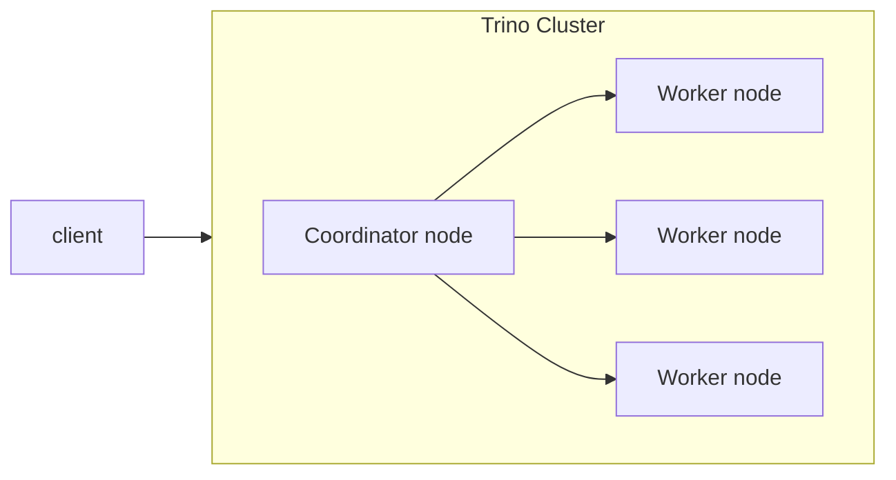
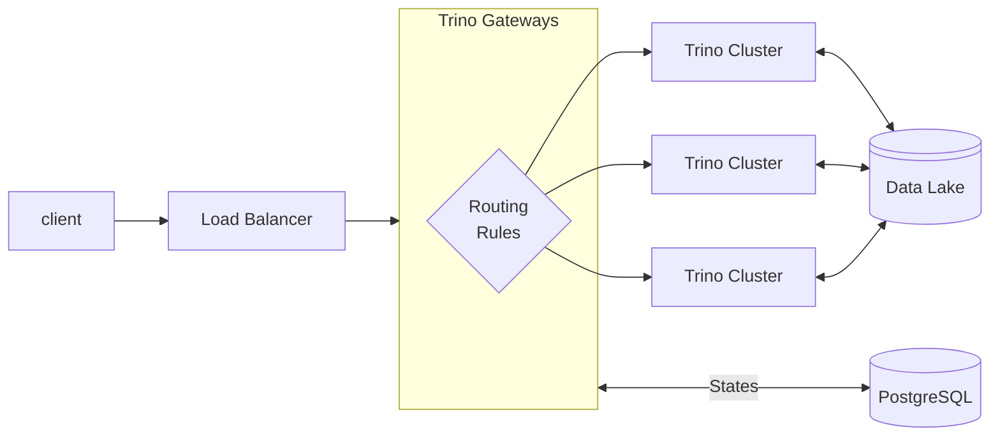
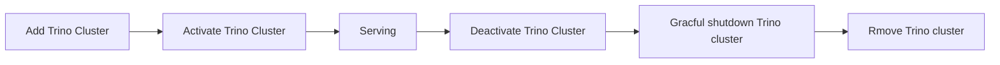

# Trino on K8S

## Getting Started

[Getting Started](./getting-started.md)

## What is Trino



## What is Trino Gateway



## Best practices

### Trino cluster lifecycle

[reference](https://trinodb.github.io/trino-gateway/operation/#graceful-shutdown)



[Trino has a graceful shutdown API that can be used exclusively on workers in order to ensure that they terminate without affecting running queries, given a sufficient grace period.](https://trino.io/docs/current/admin/graceful-shutdown.html)

### [TODO] Query routing options

### Cache layer

Consider Adding Cache Layer to Reduce Requests to Trino and Improve Response Time [[Issue](https://github.com/trinodb/trino-gateway/issues/606)]

- Query identifiers: user_query_hash and generic_query_hash
- Query result cache

### Security

- TLS configuration

  ```yaml
  serverConfig:
    http-server.http.enabled: false
    http-server.https.enabled: true
    http-server.https.port: 8443
    http-server.https.keystore.path: certificate.pem
    http-server.https.keystore.key: changeme
  ```

- Authz and Authn
