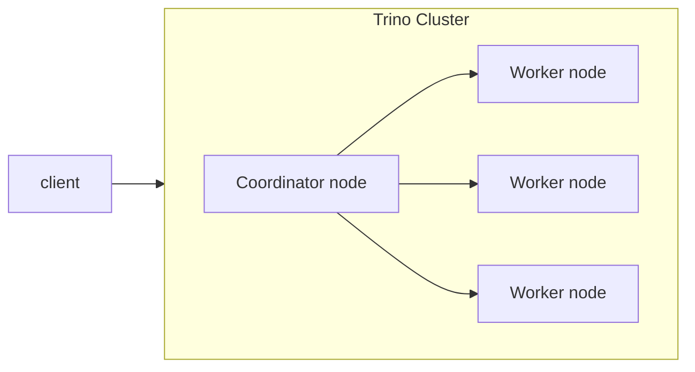
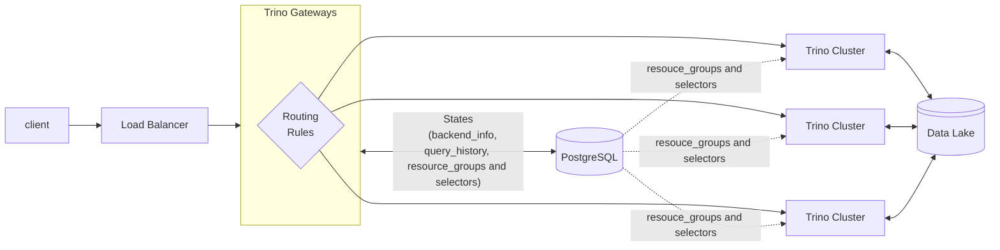
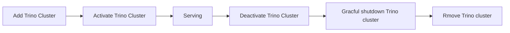

# Trino on K8S

## Getting Started

[Getting Started](./getting-started.md)

## What is Trino



## What is Trino Gateway

Terminology

1. Routing rules
2. Backend: Trino cluster
3. [Resource groups](https://trino.io/docs/current/admin/resource-groups.html#admin-resource-groups--page-root): Resource groups place limits on resource usage, and can enforce queueing policies on queries that run within them, or divide their resources among sub-groups.
4. [Selector rules](https://trino.io/docs/current/admin/resource-groups.html#selector-rules): The selector rules for pattern matching use Java’s regular expression capabilities.



Trino Gateway facilitates the management of resource groups across multiple Trino clusters, using the [database resource group manager](https://trino.io/docs/current/admin/resource-groups.html#database-resource-group-manager). It allows users to connect their Trino clusters to a centralized resource groups table maintained in the Trino Gateway's database. This setup enables management of resource groups either through the API or the Trino Gateway user interface.

## Best practices

### Trino cluster lifecycle

[reference](https://trinodb.github.io/trino-gateway/operation/#graceful-shutdown)



[Trino has a graceful shutdown API that can be used exclusively on workers in order to ensure that they terminate without affecting running queries, given a sufficient grace period.](https://trino.io/docs/current/admin/graceful-shutdown.html)

### Query routing rules

By default, Trino Gateway reads the `X-Trino-Routing-Group` request header to route requests. If this header is not specified, requests are sent to the default routing group called `adhoc`.

```yaml
# Change default routing group
routingRules:
  defaultRoutingGroup: "test-group"
```

Routing rules are defined in a configuration file or implemented in separate, custom service application. The connection to the separate service is configured as a URL. It can implement any dynamic rule changes or other behavior.

The rules file will be re-read every minute by default. You may change this by setting `rulesRefreshPeriod: Duration`, where duration is an airlift style Duration such as `30s`.

```yaml
routingRules:
  defaultRoutingGroup: "test-group"
  rulesEngineEnabled: true
  rulesType: FILE
  # rulesRefreshPeriod: 30s
  rulesConfigPath: "app/config/routing_rules.yml" # replace with actual path to your rules config file
---
routingRules:
  rulesEngineEnabled: true
  rulesType: EXTERNAL
  rulesExternalConfiguration:
    urlPath: https://router.example.com/gateway-rules # replace with your own API path
    excludeHeaders:
        - 'Authorization'
        - 'Accept-Encoding'
```

> Considering using an external routing service since file-based routing rules do not guarantee strong consistency.

#### Routing flow

[Reference: routing-logic](https://trinodb.github.io/trino-gateway/routing-logic/)


> You MUST avoid the ordering issue by writing __atomic__ rules, so any query matches exactly one rule.

#### Routing rules in FILE format

Rules are stored as a multi-document YAML file.

```yaml
---
name: "airflow"
description: "if query from airflow, route to etl group"
priority: 0
condition: 'request.getHeader("X-Trino-Source") == "airflow"'
actions:
  - 'result.put("routingGroup", "etl")'
---
name: "airflow special"
description: "if query from airflow with special label, route to etl-special group"
priority: 1
condition: 'request.getHeader("X-Trino-Source") == "airflow" && request.getHeader("X-Trino-Client-Tags") contains "label=special"'
actions:
  - 'result.put("routingGroup", "etl-special")'

# vs.

---
name: "initialize state"
description: "Add a set to the state map to track rules that have evaluated to true"
priority: 0
condition: "true"
actions:
  - |
    state.put("triggeredRules",new HashSet())
  # MVEL does not support type parameters! HashSet<String>() would result in an error.
---
name: "airflow"
description: "if query from airflow, route to etl group"
priority: 1
condition: |
  request.getHeader("X-Trino-Source") == "airflow"
actions:
  - |
    result.put("routingGroup", "etl")
  - |
    state.get("triggeredRules").add("airflow")
---
name: "airflow special"
description: "if query from airflow with special label, route to etl-special group"
priority: 2
condition: |
  state.get("triggeredRules").contains("airflow") && request.getHeader("X-Trino-Client-Tags") contains "label=special"
actions:
  - |
    result.put("routingGroup", "etl-special")

```

Three objects are available by default. They are

- request, the incoming request as an `HttpServletRequest`
- state, a `HashMap<String, Object>` that allows passing arbitrary state from one rule evaluation to the next
- result, a `HashMap<String, String>` that is used to return the result of rule evaluation to the engine

In addition to the default objects, rules may optionally utilize `trinoRequestUser` and `trinoQueryProperties` , which provide information about the user and query respectively.

The condition and actions are written in [MVEL](http://mvel.documentnode.com/), an expression language with Java-like syntax

#### External routing serivce

External routing service should be able to implement following response body in JSON format.

```json
{
    "routingGroup": "test-group",
    "errors": [
        "Error1",
        "Error2",
        "Error3"
    ],
    "externalHeaders": {
        "x-trino-client-tags": "['etl']",
        "x-trino-session": "query_max_memory=50GB,optimize_metadata_queries=false"
    }
}
```

### Security

Trino Gateway has its own security with its own authentication and authorization. These features are used only to authenticate and authorize its user interface and the APIs. All Trino-related requests are passed through to the Trino cluster without any authentication or authorization check in Trino Gateway.

#### Disable Web UI

[You can set the disablePages config to disable pages on the UI.](https://trinodb.github.io/trino-gateway/gateway-api/#disable-routing-rules-ui)

```yaml
uiConfiguration:
  disablePages:
    - "dashboard"
    - "cluster"
    - "resource-group"
    - "selector"
    - "history"
    - "routing-rules"
```

#### TLS configuration

All authentication and authorization mechanisms require configuring TLS as the foundational layer.

```yaml
serverConfig:
  http-server.http.enabled: false
  http-server.https.enabled: true
  http-server.https.port: 8443
  http-server.https.keystore.path: certificate.pem
  http-server.https.keystore.key: changeme
```

#### Authorization

Trino Gateway supports the following roles in regex string format:

- admin : Allows access to the Editor tab, which can be used to configure the clusters
- user : Allows access to the rest of the website
- api : Allows access to rest apis to configure the clusters

```yaml
# Roles should be in regex format
authorization:
  admin: (.*)ADMIN(.*)
  user: (.*)USER(.*)
  api: (.*)API(.*)
```

Web page permissions

- dashboard
- cluster
- resource-group
- selector
- history

```yaml
# admin/api can access all pages, while user can only access dashboard/history
pagePermissions:
  admin: 
  user: dashboard_history 
  api:
```

#### Authentication

- OAuth/OpenIDConnect: [sample](https://github.com/trinodb/trino-gateway/blob/main/gateway-ha/src/test/resources/auth/oauth-test-config.yml)
- Form/Basic authentication: [sample](https://github.com/trinodb/trino-gateway/blob/main/gateway-ha/src/test/resources/auth/auth-test-config.yml)
- Form/LDAP: [sample](https://github.com/trinodb/trino-gateway/blob/main/gateway-ha/src/test/resources/auth/ldapTestConfig.yml)
